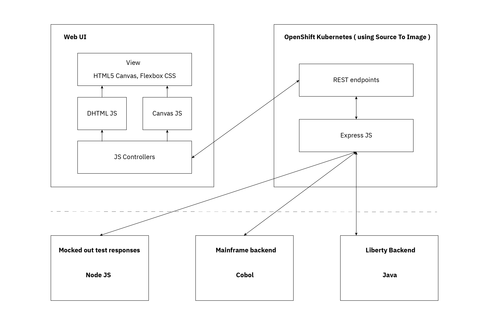
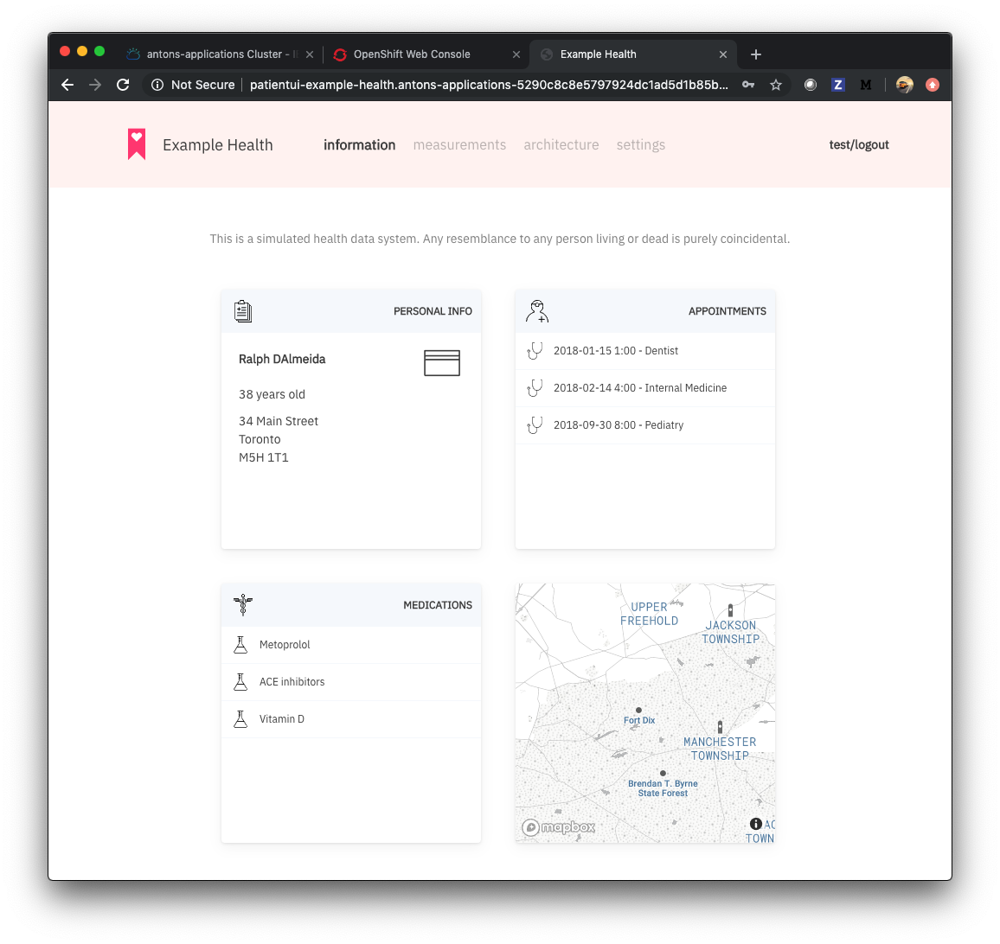

# Patient Health Records - App Modernization with RedHat OpenShift

This project is a patient records user interface for a conceptual health records system. The UI is programmed with open standards JavaScript and modern, universal CSS, and HTML5 Canvas for layout.

The UI is served by a simple Node.JS Express server, and the overall project goals are:

- to use the project to show a step by step guide of deploying the app on OpenShift Source to Image ( S2I )
- to illustrate the versatility of Kubernetes based micro services for modernizing traditional applications - for instance mainframe based applications, or classic Java app server applications
- to experiment and explore open standards front end technologies for rendering custom charts, and for responsive design

This project stands alone in test mode, or integrates with associated projects [ paths to other projects ]

#### Summit Health Context

Summit Health is a fictional, conceptual healthcare/insurance type company. It is imagined to have been around a long time, and has 100s of thousands of patient records in an SQL database connected to a either a mainframe, or a monolithic Java backend.

The business rules for the system is written in COBOL or Java. It has some entitlement rules, prescription rules, coverage rules coded in there.

Summit's health records look very similar to the health records of most insurance companies.

Here's a view a client might see when they log in:

Summit has recently started understanding how machine learning on some of the patient records, might surface interesting insights. There is lots of talk about this among some of the big data companies.

https://ai.googleblog.com/2018/05/deep-learning-for-electronic-health.html

https://blog.adafruit.com/2018/04/16/machine-learning-helps-to-grok-blood-test-results/

[ concept screenshot to come ]

Summit has also heard a lot about cloud computing. There is a lot of traditional code in the mainframe, and it works well for now ... but Summit think it may be a complimentary opportunity to explore some machine learning in the cloud ( either public or private )

Their CTO sees an architecture like this:

#### Project aims

This project aims to create a minimal data record system to flesh out this example - showing some cobol/java in action on a mainframe. Triggering a machine learning event using cloud functions, when a patient bloodtest record updates. Showing the new private cloud working alongside the old mainframe technology, and giving us a reference example to carve off pattern excerpts in an interesting collection.
